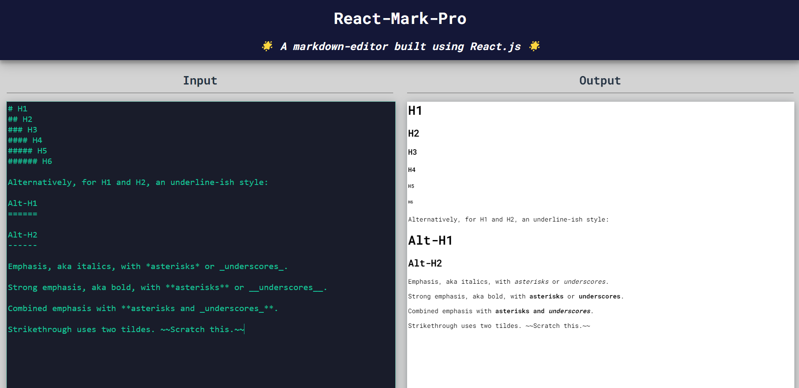

# React-Mark-Pro

The React-Mark-Pro is a web application that allows you to write and preview Markdown content in real-time built using React.js. It uses the `react-markdown` library to convert Markdown syntax into HTML for rendering.

## 📸Preview

## ✨Features

- Live Markdown Preview: As you type in the editor, the preview section updates in real-time to show the rendered Markdown content.
- Support for Markdown Syntax: The previewer supports various Markdown elements such as headers, links, code blocks, lists, blockquotes, images, and formatting (e.g., bold, italic).
- Responsiveness: Responsive for screen sizes.

## 🤖Technologies Used

The React-Mark-Pro is built using the following technologies:

- React.js: A JavaScript library for building user interfaces.
  Used React features likes states, contexts etc.
- React-Markdown: A library for parsing Markdown and converting it to HTML.
- Babel: A JavaScript compiler that enables the use of the latest JavaScript features in the browser.

## ✨Usage

1. Enter your Markdown content in the editor section of the application.
2. The preview section will update in real-time to display the rendered Markdown content.
3. Modify the Markdown content to see the preview update dynamically.

## 💻Getting Started

To run the React-Mark-Pro locally, follow these steps:

1. Clone the repository: `git clone https://github.com/its-kumar-yash/react-markdown-editor-app.git`
2. Navigate to the project directory: `cd react-markdown-editor`
3. Install the dependencies: `npm install`
4. Start the development server: `npm start`
5. Open your web browser and visit `http://localhost:3000` to access the React-Mark-Pro.

## 📑Markdown Cheatsheet

- [Basic Syntax](https://www.markdownguide.org/cheat-sheet/#basic-syntax)
- [Extended Syntax](https://www.markdownguide.org/cheat-sheet/#extended-syntax)

## 🔍Learn More About Markdown Language
 - [Learn More](https://www.markdownguide.org/getting-started/)
